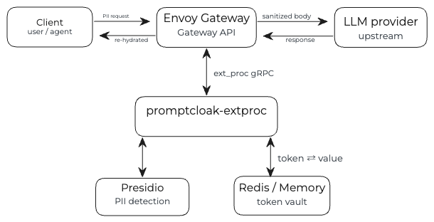

# promptcloak

A compliance gateway extension for Kubernetes that enforces data-protection
policy on LLM/chat traffic. It sits in the request path as an **Envoy
`ext_proc` service** behind a [Gateway API](https://gateway-api.sigs.k8s.io/)
data plane and **reversibly tokenizes PII** before prompts reach a chatbot,
then **re-hydrates** the real values on the way back to the user.

The model never sees the raw sensitive data; the user never sees a redaction.



## Architecture

promptcloak composes three pieces. **Envoy Gateway**, the
[Gateway API](https://gateway-api.sigs.k8s.io/) data plane, streams every chat
transaction over gRPC to the **promptcloak `ext_proc` service** (this project,
written in Go). That service delegates PII detection to a **pluggable detection
backend**, replaces each detected span with a reversible token, persists the
`token → value` mapping in **Valkey**, and restores the real values on the
response. promptcloak performs no detection logic of its own; it orchestrates
tokenization, persistence, and re-hydration around whichever detector is
configured. Detection happens behind a single Go interface (`detect.Analyzer`),
so backends are interchangeable and adding one means implementing that
interface; nothing downstream (tokenization, the vault, re-hydration) changes.
Findings are normalized to a canonical entity vocabulary and rune offsets, so
token labels and behavior stay consistent across backends.

### Detection backends

Select one with the `DETECTOR` environment variable (default `presidio`):

| `DETECTOR` | Backend | Notes |
|---|---|---|
| `presidio` | **[Microsoft Presidio](https://github.com/microsoft/presidio)** analyzer (HTTP) | Default. ML + recognizer based; widest entity coverage (PERSON, LOCATION, …). Detection quality is governed by [Presidio's config and recognizers](https://microsoft.github.io/presidio/analyzer/); see the detection-tuning note under [Quickstart](#quickstart-local-cluster). |
| `regex` | Built-in regex matcher | No external service; good for local dev, air-gapped, and tests. Only structurally-regular entities (EMAIL_ADDRESS, US_SSN, CREDIT_CARD, PHONE_NUMBER, IP_ADDRESS, URL); cannot find free-form entities like PERSON. |
| `gcpdlp` | **[Google Cloud DLP](https://cloud.google.com/dlp)** `content:inspect` (REST) | Managed cloud detection. Auth via a static token (`GCP_DLP_TOKEN`) or, in-cluster, [workload identity](https://cloud.google.com/kubernetes-engine/docs/concepts/workload-identity) (GCE/GKE metadata server). Requires `GCP_DLP_PROJECT`. |

## How it works

1. **Attach.** An `EnvoyExtensionPolicy` wires this gRPC service into an
   `HTTPRoute`. Envoy streams each transaction to it.
2. **Inbound (request).** The request body is delivered buffered. The service
   parses the chat JSON (OpenAI / Anthropic shapes), sends user-authored text to
   the configured **detection backend** for PII detection, replaces each detected
   span with a deterministic **token** (`[[CMPL_<ENTITY>_<id>]]`), stores
   `token → value` in **Valkey**, and forwards the sanitized body to the model.
3. **Outbound (response).** Response chunks are delivered streamed. The service
   swaps any of *its* tokens back to the real values (a cheap, streaming-aware
   lookup) so the end user sees their real data restored.

This is the MVP scope: **inbound prompt tokenization + response re-hydration**.
Outbound PII *detection*, MCP tool-call inspection, and RAG/context inspection
are tracked in [ROADMAP.md](./ROADMAP.md). Design details are in
[ARCHITECTURE.md](./ARCHITECTURE.md).

## Examples

Take a single chat request that contains a name and an email.

**1. What the user/agent sends.** `POST /v1/chat/completions`:

```json
{"model":"gpt-4","messages":[{"role":"user","content":"I am Jane Doe, email jane@acme.com"}]}
```

**2. What the model actually receives.** promptcloak detects the PII via
Presidio and forwards a sanitized body; the real values never leave the cluster:

```json
{"model":"gpt-4","messages":[{"role":"user","content":"I am [[CMPL_PERSON_3f2a9c1b7e4d8a06]], email [[CMPL_EMAIL_ADDRESS_a1b2c3d4e5f60718]]"}]}
```

**3. What's stored in the vault** (Valkey). The reversible `token → value`
mappings, scoped to `TOKEN_TTL`:

```
[[CMPL_PERSON_3f2a9c1b7e4d8a06]]         → Jane Doe
[[CMPL_EMAIL_ADDRESS_a1b2c3d4e5f60718]]  → jane@acme.com
```

**4. What the user gets back.** If the model echoes any of those tokens,
promptcloak re-hydrates them on the response stream:

```
model output:  "Hi [[CMPL_PERSON_3f2a9c1b7e4d8a06]], I've noted [[CMPL_EMAIL_ADDRESS_a1b2c3d4e5f60718]]."
user sees:     "Hi Jane Doe, I've noted jane@acme.com."
```

Tokens are deterministic (the same value yields the same token within and
across requests), so the model retains coreference (it can tell two mentions
refer to the same person) without ever seeing the underlying data. See the
[Quickstart](#quickstart-local-cluster) to run this end-to-end against a mock
upstream.

## Repository layout

```
cmd/extproc            ext_proc gRPC server entrypoint
internal/config        environment-driven configuration
internal/detect        pluggable PII detection (presidio / regex / gcpdlp)
internal/tokenize      reversible token format
internal/vault         token store (Valkey/Redis protocol + in-memory)
internal/redact        detect + tokenize + persist  (the request-side transform)
internal/llmbody       chat-body JSON walker (OpenAI / Anthropic shapes)
internal/rehydrate     streaming-aware token → value restoration (response side)
internal/extproc       Envoy ExternalProcessor implementation
deploy/k8s             Gateway API + ext_proc + Valkey + Presidio manifests
```

## Install with Helm

The released image and chart are published to **ghcr.io**. You need a cluster
and **Envoy Gateway** installed (see the [Quickstart](#quickstart-local-cluster)
below for the one-liner), then:

```sh
helm install promptcloak \
  oci://ghcr.io/coreoptimizer/promptcloak/charts/promptcloak \
  --version 0.1.0 \
  --namespace promptcloak-system --create-namespace \
  --set extproc.tokenSalt=$(openssl rand -hex 16)
```

By default this deploys the full evaluable stack: the ext_proc service, a
bundled **Valkey** vault, **Presidio**, a mock LLM upstream, and the Gateway API
plumbing. Test it:

```sh
kubectl -n promptcloak-system port-forward svc/promptcloak-gateway 8080:80 &
curl -s localhost:8080/v1/chat/completions \
  -H 'content-type: application/json' \
  -d '{"model":"gpt-4","messages":[{"role":"user","content":"I am Jane Doe, email jane@acme.com"}]}' | jq
```

Common overrides (`--set` or a `-f values.yaml`):

| Value | Default | Purpose |
|---|---|---|
| `detector` | `presidio` | detection backend: `presidio`, `regex`, `gcpdlp` |
| `presidio.enabled` | `true` | deploy the bundled Presidio analyzer |
| `valkey.enabled` | `true` | deploy bundled Valkey; set `false` + `vault.addr` for an external vault |
| `mockLlm.enabled` | `true` | deploy the echo upstream; set `false` + `backend.name` to front a real LLM |
| `gateway.enabled` | `true` | create GatewayClass / Gateway / HTTPRoute / ExtensionPolicy |
| `replicaCount` | `2` | ext_proc replicas |
| `image.tag` | chart `appVersion` | override the image tag |

For a minimal, no-external-services install (e.g. CI): `--set detector=regex
--set presidio.enabled=false`. See every value with `helm show values
oci://ghcr.io/coreoptimizer/promptcloak/charts/promptcloak --version 0.1.0`.

> ghcr.io packages are private until made public (see [RELEASE.md](./RELEASE.md));
> if private, `helm registry login ghcr.io` first.

## Quickstart (local cluster)

Prerequisites: a cluster (e.g. `kind`), `kubectl`, and **Envoy Gateway**:

```sh
# Validated against Envoy Gateway v1.8.1 (any recent v1.x with the
# EnvoyExtensionPolicy CRD should work).
helm install eg oci://docker.io/envoyproxy/gateway-helm \
  -n envoy-gateway-system --create-namespace
kubectl wait --for=condition=Available -n envoy-gateway-system deploy/envoy-gateway --timeout=180s
```

> **Note on detection tuning (Presidio backend).** With `DETECTOR=presidio`,
> detection quality is governed entirely by Presidio config, not this gateway.
> Out of the box the analyzer image catches PERSON / EMAIL_ADDRESS / LOCATION
> well, but the phone recognizer is threshold-sensitive (lower
> `DETECT_SCORE_THRESHOLD` to ~0.3 to catch more) and the default image has **no
> effective US_SSN recognizer**; add a custom recognizer for SSNs/secrets (see
> [ROADMAP.md](./ROADMAP.md) items 4–5). The built-in `regex` backend, by
> contrast, *does* match US_SSN out of the box.

Build and load the image, then deploy:

```sh
make docker-build IMG=ghcr.io/coreoptimizer/promptcloak/extproc:dev
kind load docker-image ghcr.io/coreoptimizer/promptcloak/extproc:dev
# point the Deployment at your tag, then:
make deploy
```

Send a request through the gateway (mock upstream echoes what it received):

```sh
kubectl -n promptcloak-system port-forward svc/promptcloak-gateway 8080:80 &
curl -s localhost:8080/v1/chat/completions \
  -H 'content-type: application/json' \
  -d '{"model":"gpt-4","messages":[{"role":"user","content":"I am Jane Doe, email jane@acme.com"}]}' | jq
```

- The echo server's logs show the body it **received**, names/emails replaced by
  `[[CMPL_…]]` tokens (the "model" never saw PII).
- The response you get back has those tokens **re-hydrated** to the real values.

## Configuration

All via environment (see [`30-extproc.yaml`](./deploy/k8s/30-extproc.yaml)):

| Variable | Default | Purpose |
|---|---|---|
| `LISTEN_ADDR` | `:9002` | gRPC ext_proc listen address |
| `HEALTH_ADDR` | `:8080` | HTTP `/healthz` + `/readyz` |
| `LOG_LEVEL` | `info` | `debug`/`info`/`warn`/`error` |
| `FAIL_OPEN` | `true` | forward (vs. reject) when a body can't be inspected |
| `DETECTOR` | `presidio` | detection backend: `presidio`, `regex`, or `gcpdlp` |
| `DETECT_LANGUAGE` | `en` | detection language (backends that support it) |
| `DETECT_SCORE_THRESHOLD` | `0.5` | minimum confidence to act on |
| `DETECT_ENTITIES` | *(all)* | comma-separated canonical entity allowlist (e.g. `PERSON,EMAIL_ADDRESS`) |
| `DETECT_TIMEOUT` | `5s` | per-call timeout for remote backends |
| `PRESIDIO_URL` | `http://presidio-analyzer.promptcloak-system.svc:3000` | analyzer endpoint (`presidio` only) |
| `GCP_DLP_PROJECT` | *(required for `gcpdlp`)* | GCP project id for DLP |
| `GCP_DLP_LOCATION` | `global` | DLP processing location (`gcpdlp` only) |
| `GCP_DLP_MIN_LIKELIHOOD` | `POSSIBLE` | DLP likelihood floor (`gcpdlp` only) |
| `GCP_DLP_TOKEN` | *(unset → metadata server)* | static OAuth2 token; else workload identity (`gcpdlp` only) |
| `GCP_DLP_ENDPOINT` | `https://dlp.googleapis.com` | DLP API base URL (`gcpdlp` only) |
| `VALKEY_ADDR` | *(unset → in-memory)* | vault backend (Redis wire protocol; bundled server is Valkey) |
| `VALKEY_PASSWORD` / `VALKEY_DB` | `` / `0` | vault auth / db |
| `TOKEN_TTL` | `24h` | mapping lifetime |
| `TOKEN_SALT` | `promptcloak` | secret mixed into token ids; **change this** |

The four `DETECT_*` knobs are shared across backends; the legacy
`PRESIDIO_LANGUAGE` / `PRESIDIO_SCORE_THRESHOLD` / `PRESIDIO_ENTITIES` /
`PRESIDIO_TIMEOUT` names are still honored as a fallback. Likewise `VALKEY_*`
falls back to the legacy `REDIS_*` names.

## Security notes

- **Fail-open vs fail-closed.** The MVP defaults to `FAIL_OPEN=true` so a
  detection-backend outage doesn't break all chat traffic. In regulated
  environments set `FAIL_OPEN=false` to reject un-inspectable requests with `503`.
- **`TOKEN_SALT`** is a secret. With a weak/shared salt, identical PII produces
  identical token ids across requests, enabling correlation. Per-session salting
  is on the roadmap.
- **Vault durability.** Use Valkey (default in the manifests) so tokens survive
  across replicas and restarts. The in-memory vault is dev-only.

## Development

```sh
make build   # compile ./bin/extproc
make test    # unit tests
make vet
```
